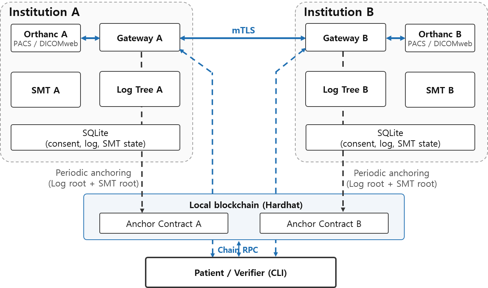

# VADREX

Research prototype for patient-consent-based cross-institution DICOM exchange with local blockchain
anchoring. This repository is the artifact for the accompanying paper: it reproduces the running
system and regenerates the paper's measurements.

Two properties are implemented and demonstrated:

1. **Anchored revocation finality.** Append-only Merkle logs (RFC 6962) and a versioned
   Sparse Merkle Tree let a patient check that the retained revocation entry is terminal in the
   provider's anchored consent history. Receiver checks compare heads from the first eligible
   anchor onward. This does not authenticate the request time or prove the absence of physical
   transfers; even a recorded receive can escape detection at the receiver baseline
   ([S2 limits](docs/LIMITATIONS.md#s2-anchored-revocation-finality-and-the-receiver-baseline)).
2. **Non-repudiation of cross-institution log references.** In the transfer handshake each gateway
   signs the peer's log entry hash and records it in its own log, so a third party can adjudicate a
   "we sent it" / "we never received it" dispute from ordinary anchoring alone.



Each institution keeps its own append-only log tree and sparse Merkle tree, and anchors both roots
periodically to its own contract. The patient verifier reads those anchors over RPC and rechecks
every proof locally, so it never has to trust a gateway's answer.

> **Research prototype — not for clinical or production use.** See [Security model](#security-model).

## Quickstart

```powershell
git clone <repository-url>
cd VADREX
.\reproduce.cmd
```

That single command checks prerequisites, installs dependencies, generates the CA and institution
keys, builds the container images, starts the chain, deploys the anchor contracts, brings up both
Orthanc instances and both gateways, loads a synthetic DICOM study, and runs a full
consent → transfer → revocation → patient-verification scenario. It writes `reproduce-status.json`
with a `verdict` field and prints `verdict=pass` when everything worked.

Then reproduce the evaluation:

```powershell
.\evaluate.cmd quick
```

| Command | Purpose | Runtime |
|---|---|---|
| `.\evaluate.cmd quick` | pipeline validation — **not paper numbers** | ~8 min |
| `.\evaluate.cmd full` | pre-paper regression check, 26 rows | ~15 min |
| `.\evaluate.cmd paper` | paper dataset, 360 rows | hours |
| `.\evaluate.cmd paper -Detach` | same, in the background | returns immediately |

Every run writes a `verdict` into `status.json`; the completion criteria (row counts, attack label
distribution, zero failures, figures) are checked by the harness, not by hand. See
[REPRODUCIBILITY.md](REPRODUCIBILITY.md).

## Prerequisites

| | Version used for the paper |
|---|---|
| OS | Windows 11 (PowerShell 5.1) |
| Node.js | 20.16.0 (see `.nvmrc`) |
| npm | 10.8.2 |
| Docker Desktop | 20.10.21, Compose v2.12.2 |

Docker Desktop must be installed and running; `reproduce.cmd` does not install it (that needs
administrator rights and often a reboot). Everything else — including Python for the figures — runs
in pinned containers.

Resource requirements: **≥ 16 GB RAM** and **≥ 40 GB free disk on `C:`**. The `paper` profile
builds a 1,000,000-leaf Merkle tree in memory and transfers a 200 MiB study through the gateway.
Check `C:` rather than the drive holding the repository: Docker's virtual disk lives under
`%LOCALAPPDATA%` wherever you cloned to. See
[REPRODUCIBILITY.md](REPRODUCIBILITY.md#1-supported-environment) for the measured breakdown.

### Installing the prerequisites

On a machine that has none of them, from an **administrator** PowerShell:

```powershell
winget install Git.Git
winget install OpenJS.NodeJS.LTS
winget install Docker.DockerDesktop
```

Docker Desktop then needs three steps no script can perform for you:

1. **Reboot.** The installer enables WSL2 and the change only takes effect after a restart.
2. **Launch Docker Desktop** and wait until the whale icon in the system tray stops animating.
   `reproduce.cmd` fails with `Cannot reach the Docker engine` until it is up.
3. **Confirm the backend** with `wsl --status` — it should report `Default Version: 2`.

If Docker Desktop reports that the WSL2 installation is incomplete, or refuses to start, hardware
virtualisation is disabled in firmware. Reboot into BIOS/UEFI and enable Intel VT-x or AMD-V. There
is no way to do this from Windows.

## Other commands

```powershell
.\reproduce.cmd -Reset          # destructive: back up and reset audit DBs, chain, contracts
.\scripts\stop-local.ps1        # stop the stack
npm test                        # unit + contract tests
```

Scenario and demo scripts (require the stack to be up):

```powershell
npm run scenario:normal         # consent -> approved transfer -> completion
npm run scenario:violations     # violation attempts blocked by the gateway
npm run scenario:barrier        # revocation barrier: settle in-flight transfer, then revoke
npm run demo:completeness       # log-tree completeness against on-chain anchors
npm run demo:concealment        # delete an anchored entry from a DB copy -> root no longer matches
npm run e2e:compliant           # full patient verification path
npm run e2e:violation           # inject post-revocation events -> detected
npm run e2e:dispute             # receiver denies receipt -> adjudicated from anchored evidence
```

Scenarios pick the first study in Orthanc A unless `SCENARIO_STUDY_UID` is set. `reproduce.cmd`
always pins its own synthetic study, so it is deterministic regardless of what else is loaded.

## Layout

```
packages/shared          canonical JSON, hashing, audit entry types
packages/merkle          RFC 6962 log tree + versioned Sparse Merkle Tree (pure verifiers)
packages/gateway         audit aggregator, anchoring loop, transfer handshake, HTTP API
packages/verifier-cli    patient verification (verify-non-transfer) and dispute adjudication
contracts                Anchor.sol, tests, deploy script
eval                     measurement harness, profiles, plotting
eval/revision            supplementary compute/end-to-end timing and gas harness
eval/reference           paper dataset (paper-v1) and supplementary run results
scripts                  bootstrap, key/CA generation, scenarios, demos
docs                     protocol contract, architecture, limitations
```

Host ports (bound to `127.0.0.1` only):
Orthanc A `8042`, Orthanc B `8043`, Gateway A `7001`, Gateway B `7002`, chain RPC `8545`.

## Documentation

- [REPRODUCIBILITY.md](REPRODUCIBILITY.md) — environment, profiles, completion criteria, artifacts,
  reset procedure, troubleshooting.
- [docs/PROTOCOL.md](docs/PROTOCOL.md) — the design contract: entry schema, canonical
  serialization, Merkle contracts, on-chain record, handshake order, verifier trust boundary.
- [docs/LIMITATIONS.md](docs/LIMITATIONS.md) — what the measurements do and do not establish. Read
  this before citing any number.
- [eval/revision/README.md](eval/revision/README.md) — the supplementary harness that separates
  local verification compute time from end-to-end scenario time and measures contract gas, with its
  measurement boundaries and published runs.

## Security model

This is a local research stack. It deliberately makes choices that are unacceptable in deployment:

- **Blockchain keys are the well-known Hardhat test accounts.** Account 0 is institution A's
  anchoring wallet, account 1 is institution B's. They are public and hold no real value.
- **The client certificate bundles use the fixed password `vadrex`** so the scripts can run
  unattended.
- **Orthanc runs with `AuthenticationEnabled: false`.** Access is gated by mTLS peer verification
  only.
- **`/dev/*` gateway endpoints are enabled** (`ENABLE_DEV_ENDPOINTS=true` in compose). They allow
  direct audit-entry injection and manual anchoring, which the demos and the evaluation harness
  need. Set `ENABLE_DEV_ENDPOINTS=false` to disable them; outside compose they are off by default.
- All ports bind to `127.0.0.1`. Nothing is exposed to the network.

What the design does keep, because the paper depends on it: no image data, patient identifier,
`consentId`, consent secret, DICOM UID, or file hash is ever written on-chain — the anchor record is
six fields (`batchId`, `rootHash`, `treeSize`, `mapRoot`, `anchoredAt`, and the emitting institution's
contract). Each institution holds only its own keys; a gateway container mounts its own key
directory read-only plus the peer's Ed25519 **public** key as a single file.

## Third-party components

Orthanc and its DICOMweb plugin (GPL-family), OpenZeppelin Contracts, Hardhat, ethers.js,
better-sqlite3, matplotlib and pandas. Container images are pinned by digest — see
[REPRODUCIBILITY.md](REPRODUCIBILITY.md#2-pinned-images), and
[THIRD_PARTY_NOTICES.md](THIRD_PARTY_NOTICES.md) for the component licences.

## License

MIT — see [LICENSE](LICENSE). Orthanc runs as a separate service reached over HTTP, so its
GPL-family licence does not extend to this code.
